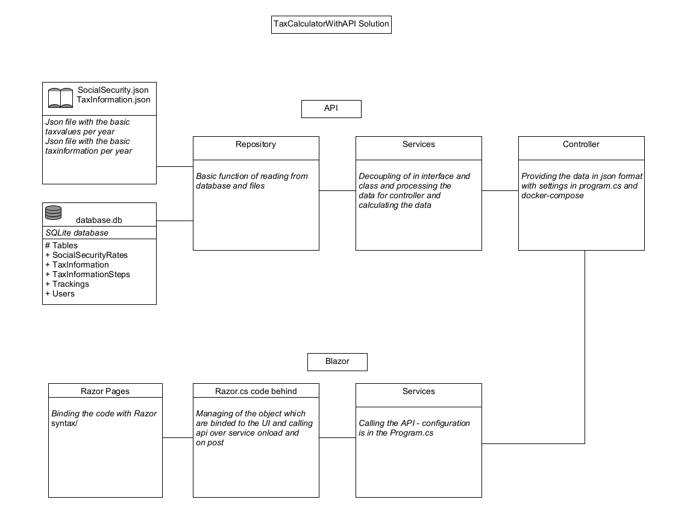

# Tax Calculator With API - Installation Guide

## 1. Used features

### Framework: BlazorServer, ASP.Net Core Web Api, Entity Framework, Identity Framework

### Persitence: SQLite, JSON-File, JSON.net, Migration Extention


## 2. Architecture of the solution

<!-- ### <project type> -->




## 3. Installation steps:

### Manuel migration of database

- **Command Nuget-Shell:**      `add-migration <name>`

- **Comman Nuget-Shell**        `update database`

### SSH-Connect from PS

- **Command PS:**               `ssh-keygen -t rsa -b 4096 -C "Email@example.com"`

- **Command Server:**           `cd .ssh`

- **Command Server:**           `nano authorized_keys - add key.pub`

- **Command PS:**               `Set-Service -Name ssh-agent -StartupType Manual`

- **Command PS:**               `Start-Service ssh-agent`

- **Command PS:**               `ssh-add mein_ssh_schluessel`

- **Command PS:**               `ssh user@ip`

- **It will find the right connection automatically by the ssh-agent**

### Transfer
- **Command:**                  `scp TaxCalculatorWithAPI.zip <user>@<ip>:<Directory>`

### Connect
- **Command:**                  `ssh <user>@<ip>`

### Stop last version
- **Command:**                  `<user>@localhost:~/<dir>/TaxCalculatorWithAPI# docker-compose down`

### Build
- **Command:**                  `<user>@localhost:~/<dir>/TaxCalculatorWithAPI# docker-compose build --no-cache`

### Upload
- **Command:**                  `<user>@localhost:~/<dir>/TaxCalculatorWithAPI# docker-compose up -d`

### Check Containers
- **Command:**                  `<user>@localhost:~/<dir>/TaxCalculatorWithAPI# docker ps`

#### Expected Output:
```plaintext
CONTAINER ID   IMAGE                        COMMAND                  CREATED          STATUS          PORTS                                                                               NAMES
79df70368d67   taxcalculatorblazorserver   "dotnet TaxCalculator"   43 seconds ago   Up 41 seconds   0.0.0.0:80->80/tcp, :::80->80/tcp, 0.0.0.0:443->443/tcp, :::443->443/tcp             taxcalculatorwithapi_taxcalculatorblazorserver_1
b0f82e6c6cf6   taxcalculatorapi             "dotnet TaxCalculator"   43 seconds ago   Up 41 seconds                                                                                        taxcalculatorwithapi_taxcalculatorapi_1
```

### Check Logs
- **Command:** `<user>@localhost:~/<dir>/TaxCalculatorWithAPI# docker logs 79df70368d67`

### Access Container
- **Command:** `<user>@localhost:~/<dir>/TaxCalculatorWithAPI# docker exec -it b0f82e6c6cf6 bash`

### List Networks
- **Command:** `<user>@localhost:~/<dir>/TaxCalculatorWithAPI# docker network ls`

### Check Internal Network
- **Command:** `<user>@localhost:~/<dir>/TaxCalculatorWithAPI# docker network inspect taxnetwork`

### Setup Docker-Compose for Docker Desktop
- **Use 80:8080 binding for Docker Desktop and use comments to hide the ASPNETCORE ssl configuration - a specific # comment tag on the start of the line could be necessary to avoid utf-8 encoding error**

### Setup Dockerfile for Docker Desktop
- **Expose port 80**

### Run on Docker Desktop
- **Use playbutton on VS. If it has a browser connection error try the normal docker commands in powershell to run on Docker Desktop**

